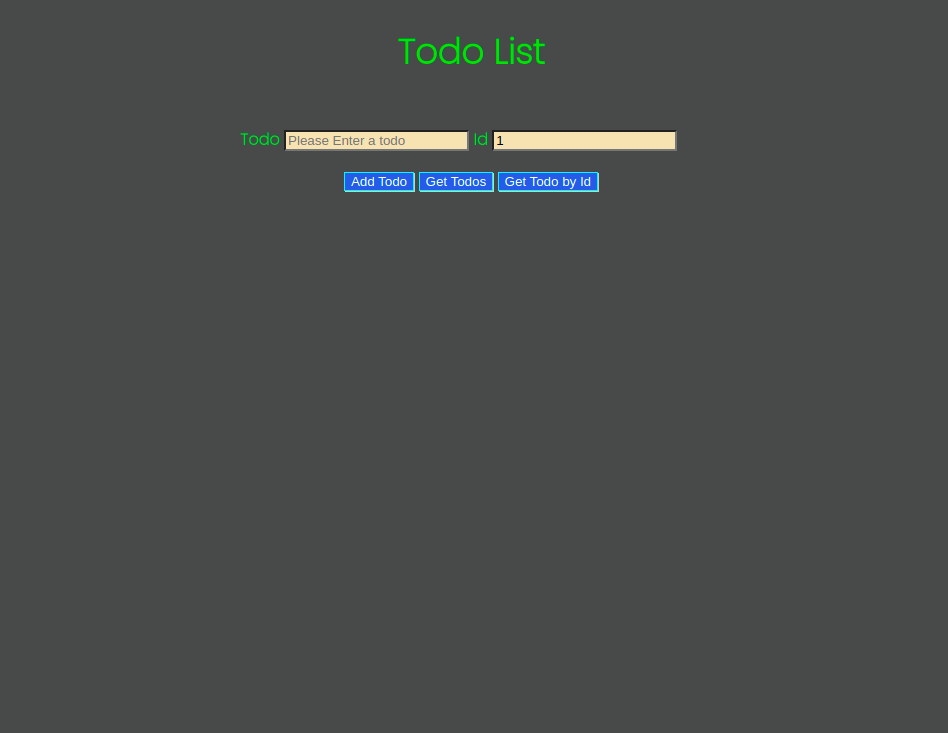

# Todo List

> A todo list allows the user to add, edit, delete, get all and get one todo by id .

## Table of contents

- [General info](#general-info)
- [Screenshots](#screenshots)
- [Technologies](#technologies)
- [Setup](#setup)
- [Features](#features)
- [Status](#status)
- [Inspiration](#inspiration)
- [Contact](#contact)

## General info

A todo list , the objective is using REST API to `POST`, `PATCH`, `DELETE`, `GET` todos to a `db.json` file .

## Screenshots



## Technologies

- JavaScript
- HTML
- CSS
- VSC code
- Json-server
- Heroku

## Setup

- `npm install`
- `npm run start`

## Code Examples

```js
"use strict";

import { Todo } from "../classes/todo.js";

// handler get one todo

export const handleGetOneTodo = async (target) => {
  const id = Number(target.currentTarget.form.id.value);

  const newTodo = new Todo();

  const todoData = await newTodo.getOneTodo(id);

  const render = await newTodo.renderTodo(todoData);
  const appendTodo = document.getElementById("root");
  appendTodo.innerHTML = "";
  appendTodo.appendChild(render);
};
```

## Features

List of features ready and Todos for future development

-
-
-

To-do list:

-
-

## Status

Project is: _in progress_

## Inspiration

## Contact

By [HYF - Group 3]
