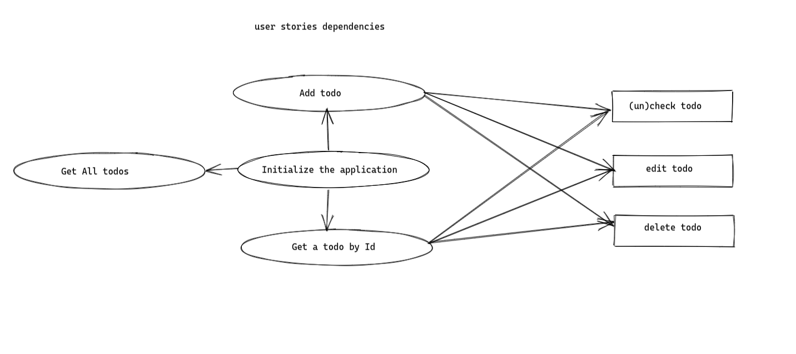
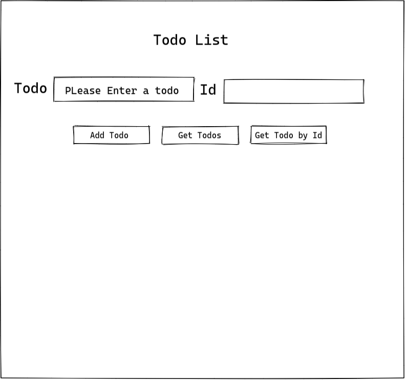

# Todo List: Practical JavaScript

A refactor of the Practical JavaScript Todo List

---

## Data

> describe the data used in your project.
>
> - what properties?
> - what types?
> - what are array entries like?

#### Data are an array of objects

---

## User Story Dependencies

---

## WIREFRAME

---

## 0.Setup

- fork the template repo `restful-pjs`
- turn on GitHub pages.
- write the first strategy plan.
- Design a simple wireframe to set guidelines for UI/UX design.
- a simple README.md

---

## 1. Initialize the home page

**As a user I want to see the home page when I load the site**

- _acceptance criteria_
- _acceptance criteria_
- ...

### REPO

- This user story is developed on branch `1-home`.
- This branch is merged to `master` branch after completion.

### Task A

`index.html`:

- this issue developed on a branch `1-home`.
- add `div` with container .
- add `h2`
- add a `form` with 5`input` , one for `todo` text input , one for `id` and three `type=button`
- add `div` for todos

### Task B

`style.css` :

- this issue developed on a branch `1-home`.
- `body` add background color , font family , color and font weight
- `div` container display flex
- `h2` add text align , font size and color
- `form` center, margin
- `input` margin, background , color, border
- `div` root add display flex

---

## 2. create a class Todo

**As a user I want to be able to update , delete and (un)check todos**

- _acceptance criteria_
- _acceptance criteria_
- ...

### REPO

- This user story is developed on branch `2-class`.
- This branch is merged to `master` branch after completion.

### Task A

`todo.js`:

- this issue developed on a branch `2-class`.
- create a file `todo.js`
- `POST` todo , fetch all `todos`, convert the response to j son object
- `GET` one todo , fetch a todo by `id` and convert the response to j son object
- `GET` all todos , fetch all todos and convert the response to j son object
- `PATCH` a todo , fetch a todo by `id`, modify the body and convert the response to j son object
- `update`todos etch all all tods , render them and append them to the `div` root
- `renderTodo` , create anew `div` parent , `li`,`completedButton`, `editButton`,`deleteButton`
- and add event listener to three button. -`renderTodos` create anew `div` and `ul` map throw all todos and render each using `renderTodo`

---

## 3- add todo

**As a user I want to be able to add a todo to the list**

- _acceptance criteria_
- _acceptance criteria_
- ...

### REPO

- This user story is developed on branch `3-addTodo`.
- This branch is merged to `master` branch after completion.

### Task A

`handleAddTodo.js`:

- this issue developed in a branch `3-addTodo`
- create a file `handleAddTodo.js`
- import the class `Todo`
- create a new todo instance
- `POST` todo and render it
- appended to the `root`

### Task B

`listenAddTodo.js`:

- this issue developed on a branch `3-addTodo`
- import `handleAddTod` handler
- get `input = button` add todo and add event listener

---

## 4- get all todos

**As a user I want to be able to get all todos in the list**

- _acceptance criteria_
- _acceptance criteria_
- ...

### REPO

- This user story is developed on branch `4-getTodos`.
- This branch is merged to `master` branch after completion.

### Task A

`handleGetAddTodos.js`:

- this issue developed in a branch `4-getTodos`
- create a file `handleGetAllTodo.js`
- import the class `Todo`
- create a new todo instance
- `GET` all todos and render them
- appended to the `root`

### Task B

`listenGetAllTodos.js`:

- this issue developed on a branch `4-getTodos`
- import `handleGetAllTodos` handler
- get `input = button` add todo and add event listener

---

## 5- get one todo by id

**As a user I want to be able to get a specific todo in the list**

- _acceptance criteria_
- _acceptance criteria_
- ...

### REPO

- This user story is developed on branch `4-getTodos`.
- This branch is merged to `master` branch after completion.

### Task A

`handleGetTodo.js`:

- this issue developed in a branch `5-getTodo`
- create a file `handleGetTodo.js`
- import the class `Todo`
- create a new todo instance
- `GET` a todo by `id` and render it
- appended to the `root`

### Task B

`listenGetTodo.js`:

- this issue developed in a branch `5-getTodo`
- import ` handleGetOneTodo`
- get `input = button` add todo and add event listener

---

## 6- init

**As a user I want to be to see a complete application with style**

- _acceptance criteria_
- _acceptance criteria_
- ...

### REPO

- This user story is developed on branch `6-init`.
- This branch is merged to `master` branch after completion.

### Task A

`style.css`:

- this issue developed on a branch `6-init`
- `div` add flex -`ul` width, margin , list style
- `li` background , font size , padding , color
- `todo-parentDiv` margin top , list style , background color and display flex
- `completed-btn` background color, font size , cursor , width and height
- `delete-btn` background, font size, margin , cursor
- `edit-btn` background, font size, margin , cursor

### Task B

`init.js`:

- this issue developed on a branch `6-init`
- import all the listeners

---
